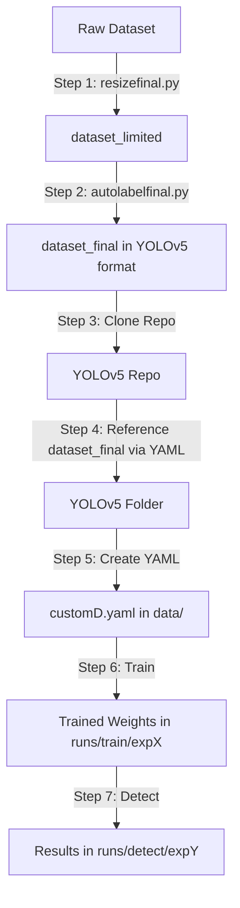

# YOLOv5 Pest Detection – Complete Training & Inference Guide

This repository provides a complete pipeline to prepare, label, train, and test a YOLOv5 model on a custom pest dataset.

---

## 📌 Steps to Prepare and Train

### 1. Resize Dataset

Use `resizefinal.py` to resize your dataset.

* Set `SOURCE_DIR` = path to your dataset
* Set `TARGET_SIZE_MB` = desired dataset size (in MB)

```bash
python resizefinal.py
```

✅ Output: A new folder `dataset_limited`

### 2. Auto-Label Dataset

Use `autolabelfinal.py` to structure your dataset in YOLOv5 format.

* Set `DATASET_DIR = "dataset_limited"`

```bash
python autolabelfinal.py
```

✅ Output: A new folder `dataset_final` (YOLOv5 format + train/val split)

### 3. Clone YOLOv5 Repository

```bash
git clone https://github.com/ultralytics/yolov5.git
cd yolov5
```

### 4. Reference Dataset

You do not need to move `dataset_final` into the YOLOv5 folder. Just ensure the `customD.yaml` paths correctly point to the location of `dataset_final`.

### 5. Create Custom YAML

Create a file `customD.yaml` (similar to `coco128.yaml`) and configure:

```yaml
train: /path/to/dataset_final/images/train
val: /path/to/dataset_final/images/val

nc: <num_classes>
names: [ 'class1', 'class2', ... ]
```

Save it inside `yolov5/data/customD.yaml`.

### 6. Train Model

You can train the model directly using:

```bash
python train.py --img 640 --batch 16 --epochs 50 --data data/customD.yaml --weights yolov5s.pt --cache
```

Or you can use the provided script `run_train.py` for simplified training.

✅ Output: Training results + weights saved in `yolov5/runs/train/expX/`

### 7. Run Inference

You can test detection directly using:

```bash
python detect.py --weights runs/train/expX/weights/best.pt --img 640 --conf 0.25 --source path/to/image_or_folder
```

Or you can use the provided script `run_detect.py` for simplified detection.

✅ Output: Results saved in `yolov5/runs/detect/expY/`

---

## 📊 Workflow Diagram (Mermaid)



---

## ✅ Notes

* Adjust `--epochs` in training as per your dataset size.
* Ensure `customD.yaml` paths match the location of `dataset_final`.
* Use the latest trained `expX` folder for detection.
* Confidence threshold in `detect.py` can be adjusted with `--conf`.
* Instead of directly using commands, you can also use `run_train.py` and `run_detect.py` for simplified execution.
